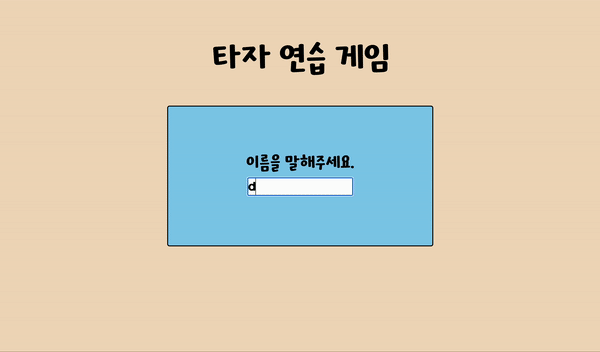
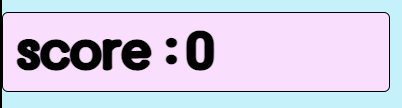
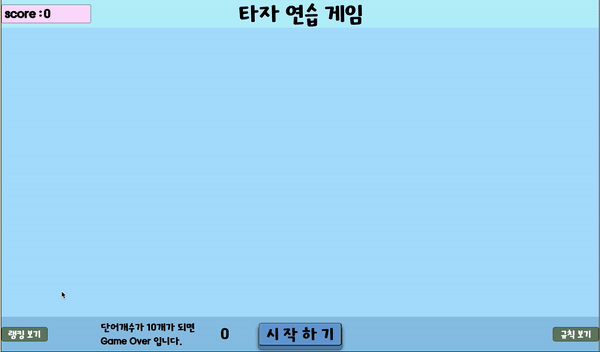
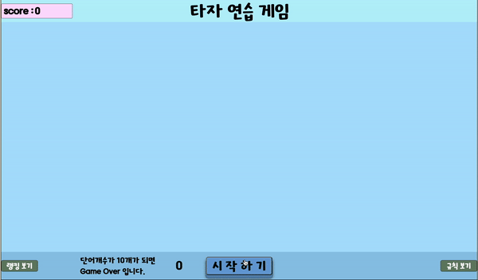
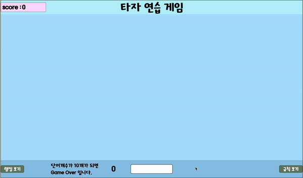
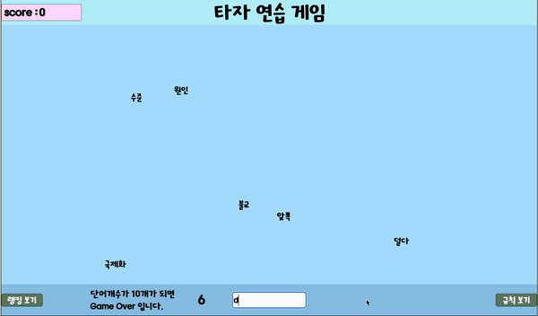

# 타자 연습 게임

Page : <https://kimsh322.github.io/typing-practice/>

vanilla javascript를 이용한 간단한 타자 연습 게임 입니다.

일정 시간 간격으로 랜덤한 위치에 랜덤한 단어가 생성됩니다.

하단의 input박스에 단어를 입력하고 엔터를 누릅니다. 일치하는 단어가 있으면 그 단어가 화면에서 지워집니다.

단어를 지우는 데 성공하면 점수가 올라갑니다.

화면에 단어가 10개가 넘어가면 Game Over입니다.

Game Over시 점수에 따라 랭킹에 등록됩니다.

---

# 완성된 기능 설명

## 입장 페이지 구현

</img>

 
웹페이지를 열면 입장 페이지가 있습니다. 
username을 입력하고 엔터를 누르면 메인페이지의 display가 flex가 되고, 
입장페이지의 display가 none이 되면서 페이지가 이동하는 것처럼 만들어 보았습니다.

 

## 화면 설명

</img>

메인 화면 왼쪽위에 점수가 나타납니다. 단어를 맞추면 점수가 올라갑니다.

 

</img>

왼쪽 아래 랭킹보기 버튼에 mouseover시 화면 중앙에 랭킹이 보입니다. 
오른쪽 아래 규칙 보기 버튼에 mouseover시 화면 중앙에 게임 규칙이 보입니다. 
랭킹보기, 규칙 보기는 css display 속성으로 구현했습니다.

 

</img>

시작 버튼을 누르면 3,2,1,start 카운트 후 게임이 시작됩니다. 
카운터는 setTimeout으로 구현하였습니다.

 

## 랜덤 단어 생성, 입력시 단어 제거

</img>

5500개 단어 배열에서 랜덤한 단어를 받아서 div박스에 담아 메인 화면에 출력합니다. 
setInterval을 사용하여 일정 시간 간격으로 화면에 단어를 생성합니다. 
점수가 높아지면 interval 간격이 줄어듭니다.

document.getBoundingClientRect 메서드의 width, height 프로퍼티와 Math.ramdom 함수로 랜덤한 위치를 만들고 
메인화면에 position absolute로 top, left 속성을 주고 생성합니다. 
do ~ while문으로 화면을 벗어나는 div박스가 없도록 처리했습니다.

단어 입력시 현재 화면에 존재하는 div박스의 textcontent를 받아 배열로 만들어 검사하여  일치하는 단어가 있는 경우 해당 div박스를 제거하도록 코드를 작성했습니다.

 

## Game Over

</img>

화면 내 단어 숫자가 input창 옆에 나타납니다. 8개 이상이 되면 빨간색으로 주의를 주고, 
단어가 10개가 되면 화면에 있는 단어가 담긴 div 박스를 지우고 Game over text를 띄웁니다. 
약간의 시간 뒤에 다시하기 버튼이 생성됩니다. 다시하기 버튼을 누르면 새로고침 되면서 입장페이지로 이동합니다.

Game over시 유저이름과 점수가 로컬스토리지에 저장되고 다시 렌더링될 때 랭킹에 추가됩니다.

 

---

# 문제 발생과 에러해결

수많은 크고작은 오류들이 있었지만 기억할만한 것 위주로 정리해보았습니다.

**Problem** 입장 페이지는 display를 변경할 때 transition이 발생하는 클래스를 바로 넣어버리면 애니매이션이 동작하지 않았습니다.

찾아보니 transition의 경우 변화가 발생했을 때 작동을 하게 되는데 display를 변경하면서 바로 class를 적용시켜버려서  
transition이 발생하지 않고 곧바로 최종 style로 변경이 되는 것이었습니다. 
그래서 **setTimeout 함수에 delay 0을 주고 사용**하여 약간의 term을 두고 클래스를 추가하니  정상적으로 transition이 동작하게 되었습니다.

 

**Problem** qureyselectorAll로 받은 객체에 배열 메서드를 사용하지 못하는 현상

querySelectorAll 메서드로 화면 내 단어들은 전부 불러와서 배열 메서드로 입력단어와 일치하는지 확인하려했는데 
메서드를 사용하는 대상이 배열이 아니라는 에러가 났습니다. 처음에는 콘솔로 찍어보니 '배열 맞는데 왜 안되지?' 
라는 생각을 헀다가 찾아보니 querySelectorAll 메서드의 반환값은 Nodelist라는 유사 배열 객체 였습니다.  
Array.from 메서드로 Nodelist 객체를 배열로 바꾸어준 후 메서드를 적용하니 정상적으로 실행되었습니다.

 

**Problem** 시작 카운터에 transition을 적용시켜 놓았는데 transition이 적용 될 때도 있고 안될 때도 있는 현상이 발생하였습니다.

setTimeout 함수를 많이 등록해놓아서 지연시간을 0으로 주었을 때 실제로는 0이 아니라 좀 더 많은 시간을 기다리거나 
혹은 다른 setTimeout 함수와 순서가 바뀌어 실행이 되어서 동작이 되었다가 안되었다가 한다는 것으로 결론을 내렸습니다. 
그래서 **시작 카운터의 경우 50ms의 지연시간을 주고 class를 동적으로 추가**하도록 하니 해결이 되었습니다.

 

**Problem** 로컬 스토리지 관련 문제들

localStorage는 저장을 할 때 JSON 파일 형식으로 저장을 하기 때문에 setItem으로 저장값을 넣을 때 JSON.stringify 메서드로  
입력해줘야 합니다.  
localStorage에 있는 값을 모두 꺼낼때 localStorage.key라는 메서드를 사용하는데 이 경우 데이터를 넣은 순서대로가 아니라  
localStorage API 내부 로직에 따라 key가 의도와 다르게 정렬되기 때문에 주의해야 합니다.

 
